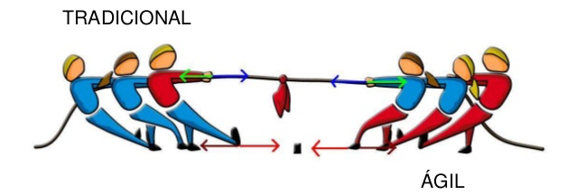
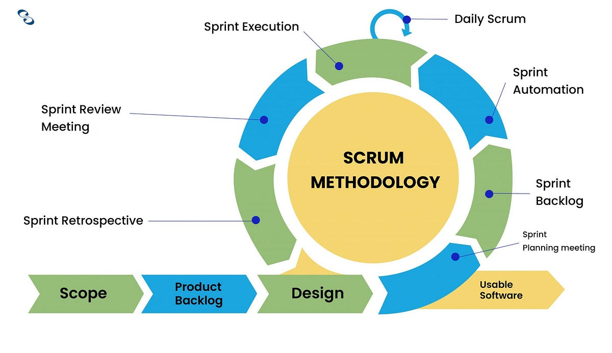

# Metodologias Ageis

## Modelo Tradicional

### Levantamento de requisitos
Nessa etapa é levantado todos os requisitos do software

### Planejamento técnico
Levantamento de custos e prazos

### Desenvolvimento
Estruturação dos códigos e desenvolvimento entre as equipes

### Testes
Software terá todos os tipos de testes possiveis

### Entrega em produção

- Forma muito demorada e de alto custo, não é mais utilizada!!!

## Manifesto Agil

- **Indivíduos e interações** mais que processos e ferramentas;

- **Software em funcionamento** mais que documentação abrangente;

- **Colaboração com o cliente** mais que negociação de contratos;

- **Responder a mudanças** mais que seguir um plano.

### Os 12 principios do manifesto agil

- _Nossa maior prioridade é satisfazer o cliente através da entrega contínua e adiantada de software com valor agregado._

- _Mudanças nos requisitos são bem-vindas, mesmo tardiamente no desenvolvimento. Processos ágeis tiram vantagem das mudanças visando vantagem competitiva para o cliente._

- _Entregar frequentemente software funcionando, de poucas semanas a poucos meses, com preferência à menor escala de tempo._

- _Pessoas de negócio e desenvolvedores devem trabalhar diariamente em conjunto por todo o projeto._

- _Construa projetos em torno de indivíduos motivados. Dê a eles o ambiente e o suporte necessário e confie neles para fazer o trabalho._

- _O método mais eficiente e eficaz de transmitir informações para e entre uma equipe de desenvolvimento é através de conversa face a face._

- _Software funcionando é a medida primária de progresso._

- _Os processos ágeis promovem desenvolvimento sustentável. Os patrocinadores, desenvolvedores e usuários devem ser capazes de manter um ritmo constante indefinidamente._

- _Contínua atenção à excelência técnica e bom design aumenta a agilidade._

- _Simplicidade--a arte de maximizar a quantidade de trabalho não realizado--é essencial._

- _As melhores arquiteturas, requisitos e designs emergem de equipes auto-organizáveis._

- _Em intervalos regulares, a equipe reflete sobre como se tornar mais eficaz e então refina e ajusta seu comportamento de acordo._

**Referência**

[Agile Manifesto](https://agilemanifesto.org/iso/ptbr/principles.html)

## Caracteristicas

- **Ciclos de vida Iterativo e Incremental**

- **Planejamento mais adequado**

- **Adaptabilidade**

- **Mitigações de riscos**

- **Cada entrega pussui valor no produto**

# Comparação métodos tradicionais vs métodos ágeis

Tradicionais | Ágeis
:-------------:|:------:
Uma única entrega | Entrega em partes
Foco em uma tarefa por vez | Foco em várias tarefas
Planejamento completo | Planejamento interativo e incremental
Comunicação com o cliente no inicio e ao final do projeto | Comunicação contínua com o cliente
Os requisitos são definidos antecipadamente | Os requisitos evoluem ao longo do projeto
Interação entre as equipes durante etapas especificas | Maior interação entre as equipes durante todas as equipes
Os testes acontecem no final do projeto | Os testes ocorrem a cada interação 

# Iniciando SCRUM

## Leitura comentada do **Guia do Scrum**:

Foi criado no ramo de desenvolvimento de produtos de software, embora hoje é utilizado em um ramo de profissão;

`developers` -> todas as pessoas incluidas no scrum;

É um framewok leve afim de atingir objetivos e criar valor;

Ele dá visibilidade maior para os problemas, afim de deixar explicito o que deveser resolvido;

Orienta os relacionamentos e interações;

### Teoria do Scrum

Baseado no empirismo e no lean thinking: 

Empirismo -> afirmando que o conhecimento vem através da experiência vivida;

O lean thinking -> Focar no que é essencial (necessário) e eliminar o que não for útil naquele momento;

Iterativo e Incremental -> ocorre por ciclos e sempre acrescentando;

Possui 4 eventos dentro do evento `Sprint`;

Os 3 pilares do Scrum:

Tranparencia -> Visivel para todos, tanto os developers quanto os stakholders, a transparencia permite a inspeção;

Inspeção -> Deve ser frequente e com excelência para detectar variações ou problemas indesejáveis. A inspeção habilita a adaptação;

Adaptação -> Se houver algum aspecto que não condiz com o aceitável, é necessário fazer ajustes;

### Valores do scrum

São 5 valores do Scrum:
- Compromisso -> Comprometimento em atingir os objetivos e suportar uns aos outros (dar suporte);

- Foco -> Trabalho da sprint atingir as metas;

- Abertura -> Abertos ao trabalhos e desafios;

- Respeito -> Respeitar e ser respeitado no Scrum Team;

- Coragem -> Coragem em fazer as coisas certas e emfrentar os problemas dificeis;

### Componentes

- Developers -> Define oque será feito na sprint; 

Atribui uma `Definição de Pronto` introduzindo qualidade; 

Adaptar o plano todo dia rumo a meta da sprint; 

Auto-responsabilidade mutuo;

- Product Owner (PO)-> Desenvolver e comunicar a meta do produto; 

Criar e comunicar claramente os itens do `Product Backlog`;

Ordenar do mais importante para o menos importantes os itens do Product BackLog;

Decisão final é do PO devendo ser acatada por todos da organização;

- Scrum Master (SM)-> O responsável pelo andamento do Scrum, se todos estão respeitando as regras do framework;

Treinar os membros do time em termo de auto-gerenciamento e cross-funcionalidades;

Tirar impedimentos para a entrega das tarefas;"O que esta te impedindo de entregar sua tarefa?!"

Garantir que todos os eventos Scrum ocorram e sejam positivos;

### Sprints

Sprint -> Cada evento vai ter um contexto especifico.

Mesmo horario e mesmo local para reduzir a complexidade;

Duração de 1 mês ou 1 mês e meio;

Só se inicia uma sprint após o término da anterior e sequencialmente;

-> Nenhuma mudança é feita se colocar a meta da spring em risco;

-> Permite previsibilidade;

-> Se baseia no que já foi feito para a tomada de decisão voltada para o futuro;

**Sprint Planning** -> 8 horas para sprints com duração de 1 mês // 4 semanas

O PO deve já estar com o Product backlog pronto para a apresntação;

O PO propõe o valor e utilidade do produto para essa sprint;

Antes da finalização do Sprint Planning deve ser definido a Meta da Sprint;

- A importância dessa sprint ;

- O que pode ser feito na sprint; // termo de tempo e complexidade

- Como será feito essa sprint; // Os developers que irão selecionar a forma de construção;

Meta da Sprint ++ os itens do Product Backlog ++ Plano para entrega == Sprint Backlog.

**Daily Scrum** -> duração de 15 minutos // mesmo horário e mesmo local // todos os dias durante a sprint;

Seleção de técnicas e estruturas que desejam executar durante aquela sprint;

Somente Developers// a não ser que o SM ou o PO seja developer também;

Concentra-se no progresso  em direção a Meta da sprint e produza um plano de ação para o próximo dia de trabalho;

Horário pode ser flexivel, podendo ocorrer no inicio do dia, ou no fim.

**Sprint Review** -> Máx. 4 horas para uma sprint de 1 mês;

Stakeholders juntamente com o Scrum Team irão testar e discutir sobre a sprint finalizada;

Inspecionar o término da sprint e verificar se haverá adaptações para as futuras;

O scrum Team apresenta os resultados para os stakeholders e discutem sobre a progresso em direção a meta do produto;

**Sprint Retrospective** -> 3 horas em sprint de duração de 1 mês;

Planejar maneiras de aumetar a qualidade e ficacia.

Melhoria continua;

O scrum team junto com o PO e o SM discutem o que deu certo e o que deu errado durante a sprint, se irá manter o que deu certo ou o que deu errado como será corrigido;

### Scrum Artifacts

Os artefatos representam trabalho ou valor;

Cada artefato contém um compromisso;

Existem para reforçar o empirismo;

Product Backlog -> Meta do produto;

Sprint Backlog -> Meta da sprint;

Incremento -> Definição de pronto;

## Product Backlog

O que torna a meta do produto realizado;

Nada mais é do que uma lista ordenada e emergente do que é necessário para melhorar o produto;

É a fonte de trabalho do Scrum Team;

Seus itens são desenvolvidos através das Sprints;

E esse Product backlog pode passar por um refinamento `Product Backlog Refinement` no qual haverá o ato de quebra e definição, afim de transformar o product backlog em problemas menores e mais precisos;

Descrição ordem e tamanho;

O PO pode influenciar os developers;

**Meta do produto** -> 
Descreve um estado futuro do produto;

É o objetivo a longo prazo para o Scrum team. Eles devem cumprir (ou abandonar) um objetivo antes de assumir o próximo;

## Sprint Backlog
Por que -> Meta  da sprint;

O que -> Os itens /Product Backlog;

Como -> Plano de ação /Incremento;

Feito por e para `developers` é uma imagem altamente visivel em tempo real do trabalho em que os developers planejam realizar durante a sprint para atingir a meta da sprint;

E o PO pode propor modificações;

A sprint backlog é atualizada ao longo da sprint conforme mais é aprendido;

**Meta da sprint** -> Criada durante o `Sprint Planning` são as metas daquelas sprint;

A Meta da Sprint também cria coerência e foco, encorajando o Scrum Team a trabalhar junto ao invés de iniciativas separadas;

## Incremento

Um passo mais próximo da meta do produto;

Um incremento anterior é utilizável na próxima;

A soma dos incrementos é apresentado no Sprint Review;

Só é considerado um incremento após a definição de pronto;

**Definição de Pronto** -> É considerada como definição de pronto após atender as medidas de qualidades exigidas para o produto;

Se não obter definição de pronta, ela volta e pode ser considerada em uma nova sprint;

DOD -> Definition Of Done;

**Referência**
[Guia do Scrum 2020](https://scrumguides.org/docs/scrumguide/v2020/2020-Scrum-Guide-PortugueseBR-3.0.pdf)